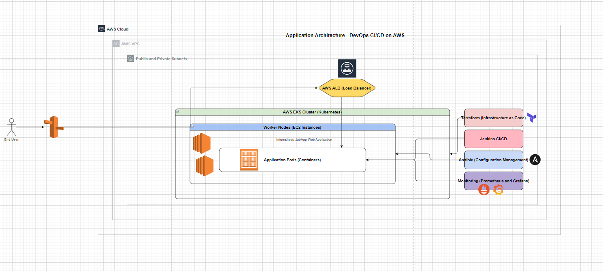
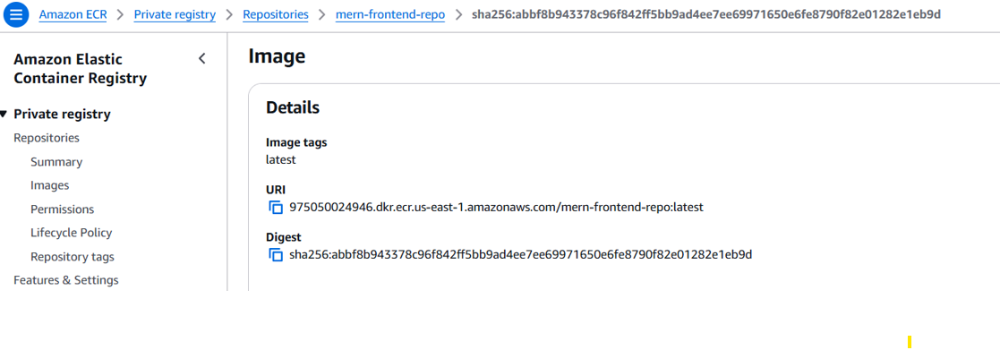
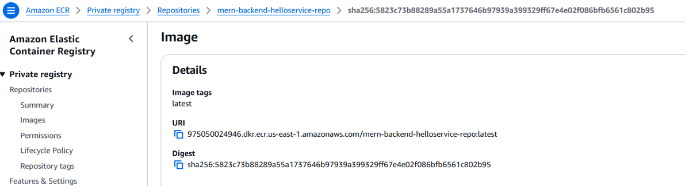
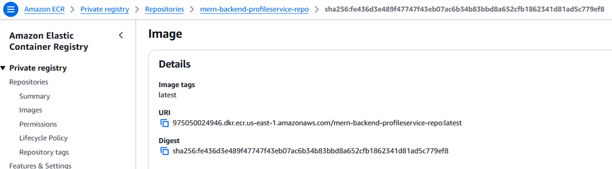

# Devops_Capstone_4

## Objective
 End-to-End DevOps Pipeline for a Web Application with CI/CD

---

## Problem Statement: [ProblemStatement.md](ProblemStatement.md)

---

## Application API documentation: [backend/README.md](backend/README.md)

---

## Prerequisites
- Fork the repository https://github.com/UnpredictablePrashant/SampleMERNwithMicroservices.git to your github https://github.com/SyamalaKadmi/SampleMERNwithMicroservices.git

---

## Instructions

### 1. Architecture Design, Dockerization, and Jenkins Setup
1. Design Application Architecture
    - Use AWS EKS for Kubernetes cluster management.
    - Deploy a web application containerized with Docker.
    - Store container images in AWS ECR.
    - Use Terraform for Infrastructure as Code (IaC).
    - Automate configuration with Ansible.
    - Monitor with Prometheus & Grafana.
    
    - Draw.io architecture diagram can be found at [Capstone.drawio](Capstone.drawio)
2. Clone the forked repository to your local using 
    ```bash
        git clone https://github.com/SyamalaKadmi/SampleMERNwithMicroservices.git
    ```
    - This application contains frontend & backend(helloService, profileService). Create a docker file for each service
3. Create .env files for helloService & ProfileService in backend
    - helloService
        ```
            PORT=3001
        ```
    - profileService
        ```
            PORT=3002
            MONGO_URL="specifyYourMongoURLHereWithDatabaseNameInTheEnd"
        ```
4. Install AWS CLI for windows from official website
5. Verify the installation
    ```bash
        aws --version
    ```
6. Configure AWS CLI:
    Run the following command and enter your AWS Access Key, Secret Key, Region, and Output format. You can get Access Key & Secret Key from AWS IAM policies
    ```bash
        aws configure
    ```
7. Create docker files for frontend and backend (helloService & profileService) respectively
    - helloservice [HelloServiceDockerfile](backend/helloService/Dockerfile)
    - profileservice [profileServiceDockerfile](backend/profileService/Dockerfile)
    - frontendservice [frontendDockerfile](frontend/Dockerfile)
8. Build the docker images
    ```bash
    cd ./SampleMERNwithMicroservices
    docker build -t mern-frontend-image ./frontend
    docker build -t mern-backend-helloservice-image ./backend/helloService
    docker build -t mern-backend-profileservice-image ./backend/profileservice
    ```
9. Push Docker Images to Amazon ECR:
    1. Create a reppository for each image
        ```bash
            aws ecr create-repository --repository-name mern-frontend-repo
            aws ecr create-repository --repository-name mern-backend-helloservice-repo
            aws ecr create-repository --repository-name mern-backend-profileservice-repo
        ```
        
    2. Authenticate Docker to ECR
        ```bash
            aws ecr get-login-password --region <region> | docker login --username AWS --password-stdin <account-id>.dkr.ecr.<region>.amazonaws.com
        ```
    3. Tag and push the docker images to the ECR
        - Frontend
        ```bash
            docker tag mern-frontend-image:latest 975050024946.dkr.ecr.us-east-1.amazonaws.com/mern-frontend-repo:latest
            docker push 975050024946.dkr.ecr.us-east-1.amazonaws.com/mern-frontend-repo:latest
        ```
        

        - backend - helloService
        ```bash
            docker tag mern-backend-helloservice-image:latest 975050024946.dkr.ecr.us-east-1.amazonaws.com/mern-backend-helloservice-repo:latest
            docker push 975050024946.dkr.ecr.us-east-1.amazonaws.com/mern-backend-helloservice-repo:latest
        ```
        

        - backend - profileService
        ```bash
            docker tag mern-backend-profileservice-image:latest 975050024946.dkr.ecr.us-east-1.amazonaws.com/mern-backend-profileservice-repo:latest
            docker push 975050024946.dkr.ecr.us-east-1.amazonaws.com/mern-backend-profileservice-repo:latest
        ```
        

10. Setup Jenkins on EC2
    - Create an EC2 instance - Amazon Linux 2, t2.micro, and allow the port 8080 for Jenkins
    - Login to the created EC2 instance
        - Install Java (Required for Jenkins)
        ```bash
            sudo yum update -y
            sudo yum install -y java-11-amazon-corretto
        ```
        - Add Jenkins repository
        ```bash
            sudo wget -O /etc/yum.repos.d/jenkins.repo https://pkg.jenkins.io/redhat-stable/jenkins.repo
            sudo rpm --import https://pkg.jenkins.io/redhat-stable/jenkins.io-2023.key
        ```
        - Install & Start Jenkins
        ```bash
            sudo yum install -y jenkins
            sudo systemctl start jenkins
            sudo systemctl enable jenkins
        ```
        - Access Jenkins
        Get the initial password from 
        ```bash
        sudo cat /var/lib/jenkins/secrets/initialAdminPassword
        ```
        - Open Jenkins in the browser: http://<ipaddress>:8080/ and enter the copied password and setup an admin user
        - Install the required plugins - Git, Github, Docker Pipeline, AWS CLI, Kubernetes CLI, Terraform
        - Configure credentials for AWS, DockerHub, and GitHub - Go to Jenkins Dashboard -> Manage Jenkins -> Credentials -> System -> Global credentials (unrestricted) -> Add Credentials
  11. Create IAM Role and Attach to EC2:
      - Permissions: AmazonEC2FullAccess, AmazonEKSFullAccess, AmazonS3FullAccess, AmazonECRFullAccess
  12. Connect Jenkins to GitHub. Generate SSH key inside EC2:
      ```
      ssh-keygen -t rsa -b 4096
      cat ~/.ssh/id_rsa.pub
      ```
      - Add this public key to your GitHub repo as a deploy key.
      - Add credentials in Jenkins (GitHub personal access token).

---

### 2. AWS Infrastructure Provisioning with Terraform and Jenkins Integration
1. Install Terraform
   ```
   sudo apt install unzip
   wget https://releases.hashicorp.com/terraform/X.X.X/terraform_X.X.X_linux_amd64.zip
   unzip terraform_X.X.X_linux_amd64.zip
   sudo mv terraform /usr/local/bin
   ```

2. Create Terraform Configuration Files
   ```
       mkdir -p ~/terraform/
       cd ~/terraform/
   ```
   1. [vpc.tf](terraform/vpc.tf) 
   2. [eks.tf](tScripts/Terraform/eks.tf) 
   4. [iam.tf](Scripts/Terraform/variables.tf)
   5. [security.tf](terraform/outputs.tf) 
   6. [backend.tf](Scripts/Terraform/backend.tf)
      - Important: Create an S3 bucket manually before running Terraform:
      ```
         aws s3 mb s3://sk-terraform-state-bucket
      ```
3. Initialize and Apply Terraform
   Run the following commands in the Terraform project directory:
   ```
      terraform init       # Initialize Terraform
      terraform plan       # Preview changes
      terraform apply -auto-approve   # Apply changes
   ```
   Verification:
   ```
      aws eks list-clusters --region us-east-1
   ```
4. Configure Terraform in Jenkins
   . Navigate to Jenkins Dashboard
   . Create a new jenkins job --> Jenkins Dashboard → New Item → Pipeline → OK
   . Under Pipeline Definition, select Pipeline Script
   . Add the script
   ``` groovy
    pipeline {
    agent any
    stages {
        stage('Terraform Init') {
            steps {
                sh 'cd terraform && terraform init'
            }
        }
        stage('Terraform Plan') {
            steps {
                sh 'cd terraform && terraform plan'
            }
        }
        stage('Terraform Apply') {
            steps {
                sh 'cd terraform && terraform apply -auto-approve'
            }
        }
     }
   }
   ```

---

### 3. Configuration Management with Ansible and Jenkins Pipeline
1. Install Ansible on Jenkins Server
   ```
    sudo apt update
    sudo apt install -y ansible
    ansible --version
   ```
2. Create Ansible Inventory File
   ```ini
    [web]
    <YOUR_EC2_PUBLIC_IP> ansible_user=ubuntu ansible_ssh_private_key_file=~/.ssh/id_rsa
   ```
3. Create Ansible playbook [ansible/playbook.yaml](ansible/playbook.yaml)
4. Role tasks [ansible/roles/setup/tasks/main.yml](ansible/roles/setup/tasks/main.yml)
5. SSH Key Setup
   - Ensure Jenkins Server has access to the target EC2 instance
   ```
    ssh-keygen -t rsa -b 4096 -f ~/.ssh/id_rsa_ansible
   ```
   - Add the public key to EC2 ~/.ssh/authorized_keys
   - Use the private key (id_rsa_ansible) in the inventory.ini file
6. Jenkins Pipeline to run Ansible script -
   ```
    stage('Ansible Provision') {
    steps {
        sh 'ansible-playbook -i inventory setup-docker.yml'
     }
   }
   ```

---

### 4. CI/CD Pipeline for Application Deployment on Kubernetes (EKS)
1. After pushing the docker images to ECR, proceed with creating Kubernetes Deployment Manifests
2. Kubernetes Deployment Manifests are located at [k8s](k8s) folder
3. Jenkins Pipeline to run Deployment - [k8/JenkinsFile](k8s/JenkinsFile)

---
### 5. Monitoring & Alerting Setup with Prometheus, Grafana, and Jenkins
1. Add Monitoring Stack to EKS
   ```
    helm repo add prometheus-community https://prometheus-community.github.io/helm-charts
    helm repo update
    helm install prometheus prometheus-community/kube-prometheus-stack --namespace monitoring --create-namespace
   ```
   This installs Prometheus, Grafana, Alertmanager, kube-state-metrics, node-exporter
2. Verify Installation
   ```
    kubectl get pods -n monitoring
    kubectl get svc -n monitoring
   ```
3. Install prometheus plugin in Jenkins
4. Expose Jenkins Metrics. Manage Jenkins -> Prometheus
   - Enable endpoint at /prometheus
   ```
    - job_name: 'jenkins'
      metrics_path: '/prometheus'
      static_configs:
       - targets: ['<jenkins-service>:8080']
5. Folder structuer
   ```
    monitoring/
   ├── prometheus/
   │   ├── config-map.yaml
   │   ├── deployment.yaml
   │   ├── service.yaml
   │   └── alert-rules.yaml
   ├── grafana/
   │   ├── deployment.yaml
   │   ├── service.yaml
   │   └── datasources-config.yaml
   ├── alertmanager/
   │   ├── config-map.yaml
   │   ├── deployment.yaml
   │   └── service.yaml
   ```
6. Deploy everything
   ```
   kubectl create namespace monitoring
   kubectl apply -f monitoring/prometheus/
   kubectl apply -f monitoring/grafana/
   kubectl apply -f monitoring/alertmanager/
7. Access URLs
    ```
    Prometheus: http://<NodeIP>:30090
    Grafana: http://<NodeIP>:30300 (default user: admin, password: admin)
    Alertmanager: http://<NodeIP>:30093
    ```

---

### 6. Testing, Documentation, and Final Pipeline Automation
1. Automate Jenkins Pipeline Triggers
2. GitHub Webhooks (Push to GitHub triggers Jenkins build)
   - Go to GitHub → Your Repo → Settings → Webhooks
   - Add webhook:
     ```
     Payload URL: http://<JENKINS_URL>/github-webhook/
     Content type: application/json
     Trigger: Just the push event.

3. Jenkins Job Settings
   - Check Build Triggers → GitHub hook trigger for GITScm polling.
4. Create a JenkinsFile to perform the complete implementation of all sprints [JenkinsFile](JenkinsFile)
5. Testing
   - For application tests
     ```
     npm install --save-dev mocha chai supertest
     ```
   - Test case present under [test/api.test.js](test/api.test.js)
   - Jenkins script for running tests
     ```
     npm test || exit 1
     ```

